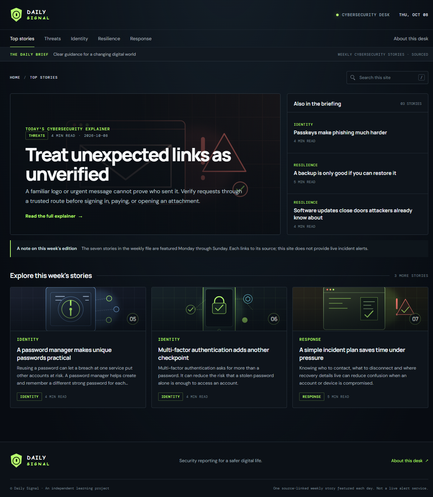
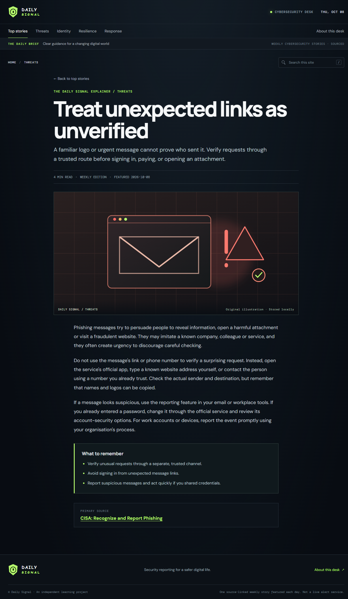

# Daily Signal

**Source-linked cybersecurity explainers, presented in a clean daily briefing.**

[Visit Daily Signal](https://news.yashmaheshwari.fyi/)



## At a glance

- Seven reviewed stories rotate through a daily feature, Monday–Sunday (UTC).
- Search, topic filters, full articles, key takeaways, and links to primary sources.
- Responsive static site with original SVG illustrations stored locally.
- Hosted on GitHub Pages; no backend, AI API, or external content feed.

## Article view



## Publishing

Update [`weekly-news.json`](weekly-news.json) with seven reviewed stories in Monday-to-Sunday order, then push to the default branch. GitHub Actions validates the content, updates the daily feature, and deploys the site.

The workflow also runs ten times per UTC day to rotate the wordmark font. Those commits are cosmetic—not ten separate features or articles. Scheduled runs may be delayed or skipped, so ten commits every day are not guaranteed.

## Development

Run the tests with Node.js:

```sh
node --test
```

To preview the site, serve the repository root using any local static HTTP server.

---

Daily Signal is an independent learning project, not a live alert service. Check linked sources for current security guidance.
